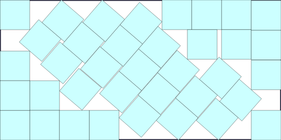
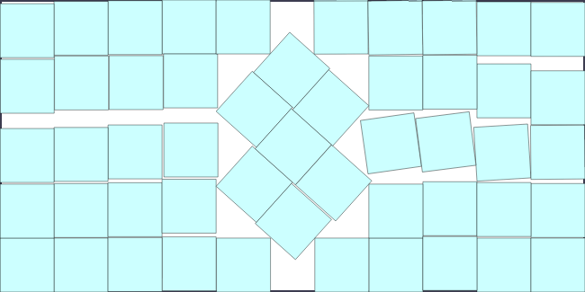
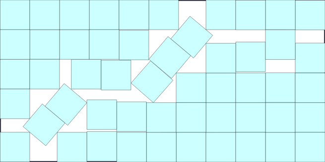
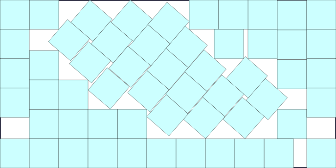

# Improved Square Packing in Dominoes for 37, 51, 52, 56 Squares

## Abstract
This repository presents a new best known packing for the Squares in Dominoes packing problem for n = 37, 51, 52, 56. The discovered side lenght of the domino for n = 37 $\approx$ 4.7236 improves the previous best known packing by Maurizio Morandi in August 2012.

## Visualization
37 squares:

51 squares:

52 squares:

56 squares:

## Verification
To verify the validity of these packings this python code [check](square_packer_checker.py) was used.
For $\varepsilon=10^{-4}$ it confirms these packings which is enough to show the 3 digit sidelenghts are correct.

## Methodology
The solutions for 37, 51, 52 squares were found using a python physical-annealing program, while the solution for 56 squares was found by adding an "U" to the solution for 37 squares.
